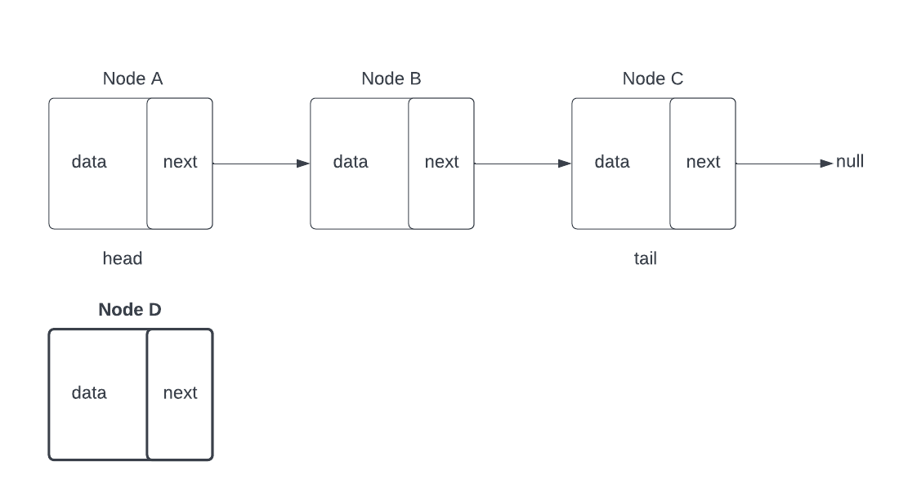
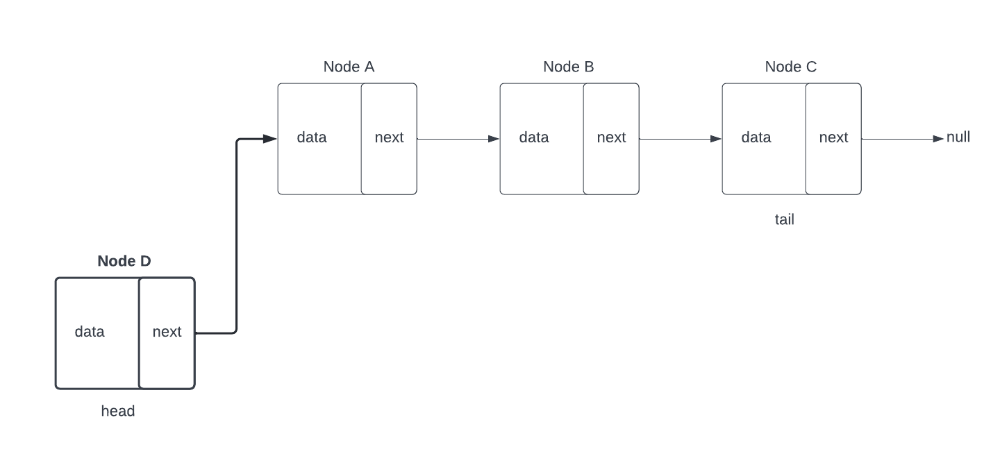
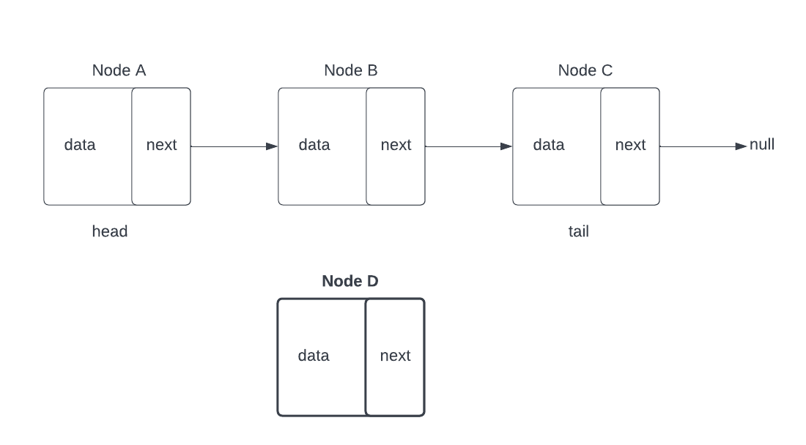
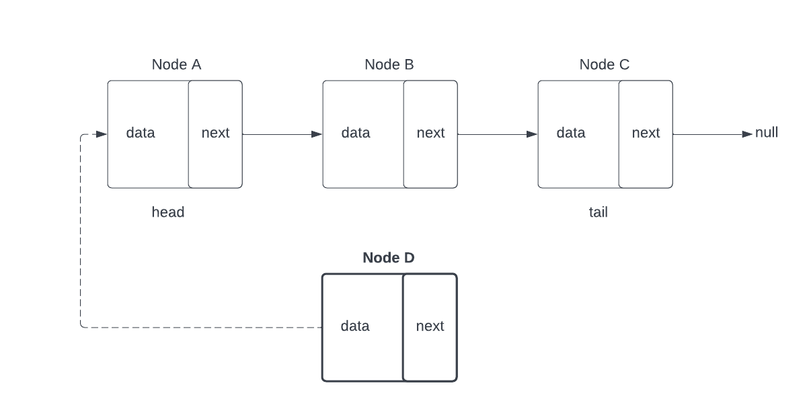
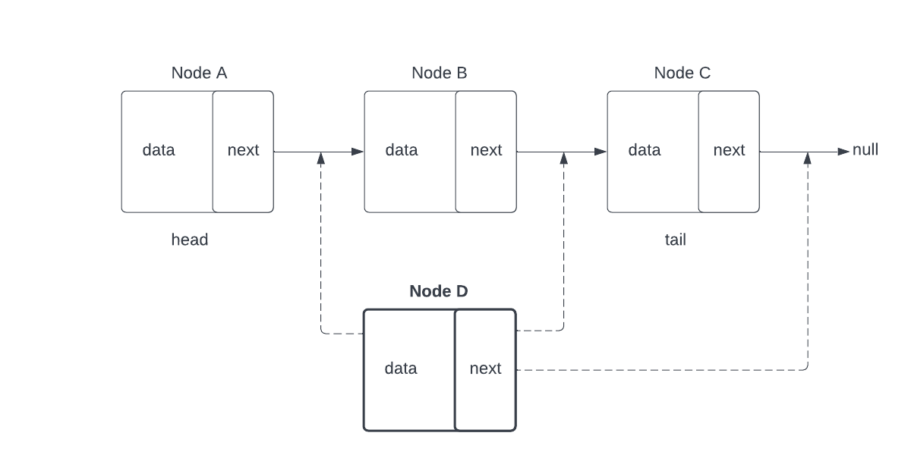
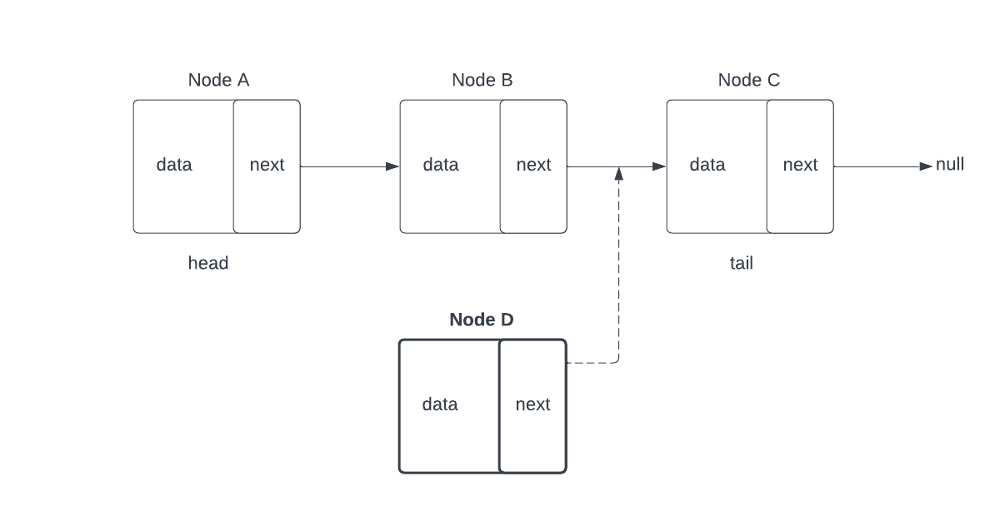
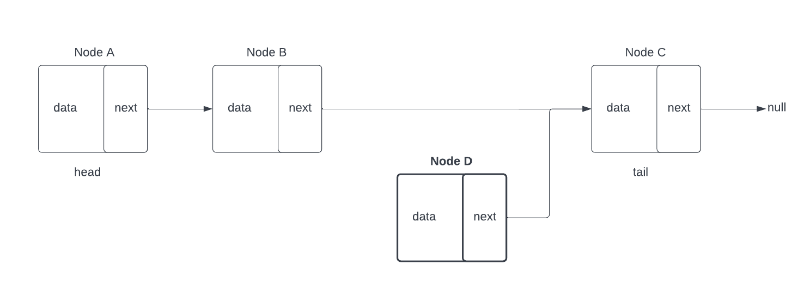
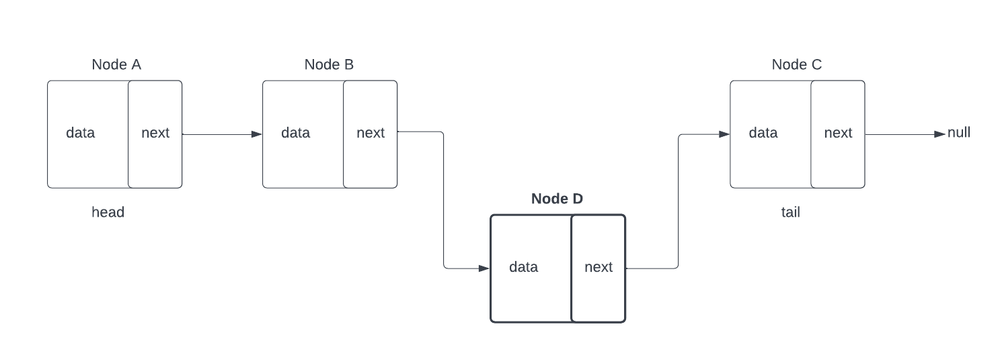

# Linked Lists

## Introduction

A **_Linked List_** is a linear data structure where elements each have a memory address that points to the next element in the list. This is different from arrays, where elements are stored sequentially in memory. In a **Linked List**, individual elements contain the memory address of the next element in the list *wherever* that may actually be in memory. This notion of holding the memory address of the next element is called a **_pointer_** and is very common.

First, we should look at what types of artifacts that typically make up a Linked List. More often than not, a ***LinkedList*** class will be composed of not only the parent class, i.e. `LinkedList`, but also a supporting subclass called a `Node`. 

Objects created from this **Node** class will serve as the actual elements of our list and, in its most basic form, only cares for two class variables: 
	- The first, and most important piece, is a variable to hold the `data` itself. Here we use the power of *generics,* `<T>`, to ensure that this LinkedList can store objects of any type that we specify. 
	- The next class variable that the Node will store will typically be of type `Node<T>` and will actually contain the next node object in the list (or at least a reference to it). We call this variable `next` to denote that it is the *next* node. 

Lets take a look at how this concept may look in Java: 

Now that we know about the **Node** subclass, lets start to logically uncover the inner workings of a Linked List. As mentioned previously, a linked list is a series of nodes that contain references to the next node in the list. That said, a diagram of how a linked list's flow might look something like this:

In this diagram, Node A is referred to as our **_head_** node and is the first node in the list. Every time we wish to iterate through our list from start to finish, the head node will always be our starting point. Once we have our head node object, we can check what is contained within the `data` variable, then continue moving to the *next* Node object (Node B) which is stored in the variable `next`. We can continue this same series of steps up until the point where we realize that the `next` variable is actually pointing to `null`, not another valid node object. At this point, we have reached the end of our list.

In the above introduction, we have mentioned one of the two important nodes of a linked list, the **Head** node. In the next section, we will be discussing supported operations and introducing the other important node: the **Tail** node, the *last* valid node in the list.

## Linked List Operations

There are many different operations that are important to working with any data structure in Java. Although we are focusing on Linked Lists in this lesson, we can also think about these operations in other data structures too. Said operations that we will discuss are as follows:

- **Insertion**: Adding a new element to the list.

- **Retrieval**: Searching for a specific element within the list.

- **Deletion**: Removing a specific element within the list.

### Insertion

The Insertion operation is the act of adding a new element to the list. We can insert data in several ways depending on the needs of the data structure. A few operations to discuss are as follows:

- *Inserting* to the **End** of an ***Unordered*** Linked List

- *Inserting* to the **Front** of an ***Unordered*** Linked List

- *Inserting* in the **Middle** of an ***Ordered*** Linked List

#### Inserting to the End of an Unordered Linked List

In an *unordered* linked list (**not sorted**), adding to the end of the list is as simple as creating a new Node object to contain the data, setting its `next` variable to point to null, and updating the **current** *tail* node to point to our **new** *tail* node. Here are diagrams of the operation:

Below we created our new node (Node D), yet to be inserted into our Link List. 

In the diagram above, we can see that a new Node object has been created, but it is currently floating in space and is not linked to our list.

Second, since we are inserting our new node to the end of our Link List, we must make its `next` value point to `null`. This will signify that there is no other node after Node D.

After we assign Node D's `next` variable to `null`, we still don't have a way to actually *reach* Node D. For that, we need to access our *tail* node from earlier, Node C. With it we have to replace Node C's `next` value from `null` to our Node D object. This will completely insert our new node as our **new tail node** of our Link List. 
> If we were actually referencing code here, we would likely have a Node variable on the LinkedList class called `tail`, that currently contains the Node C object.

*(Here we can see that Node C now points to Node D as `next` in the list. Again, if we were  writing code here, we would want to update the `tail` variable on our LinkedList class so that it accurately holds Node D as our **new tail**.)*

#### Inserting to the Front of an Unordered Linked List

Inserting to the front of the list is just as simple as our previous example. 

We start with creating a new Node object. 

Then, instead of pointing to `null`, we must point the new node to the current '***head***', Node A.
Afterwards, we must update the '***head***' variable to point to our *newly* created node as the new first element in the list.

#### Inserting in an Ordered Linked List

An ordered linked list is a little more complicated, because the list is sorted. We must take into account that we are adding a new node **in order** within the list of multiple other nodes. Thus, we must traverse through our list, comparing the values of existing nodes to our new node in order to determine the correct location to insert. 

Below we list the steps in ording our Linked Lists from smallest to largest:
1. Create our new Node object to hold our data

2. Begin our traversal by comparing our new node to the current 'head' node:

	- If our new node is **smaller** than the head node, our new node should *become first* in the list. Follow process for [[#Inserting to the Front of an Unordered Linked List]] 
	- If our new node is **larger** than the head node, we need to *continue* our traversal by grabbing the next node and repeating the comparison until we either find a condition where our new node is ***smaller***, **or** we reach the ***end of the list***.

		- If we reach the end of the list (where `next` points to `null`), then follow steps from: [[#Inserting to the End of an Unordered Linked List]].
		- If we find a loction in the list that isn't either at the end nor the front of our Linked List, move on to step 3. 
3. In order to insert in the **middle** of the list, a few things must occur to keep everything linked. 
   Lets assume we are inserting a new node, Node D, between Node B, and Node C:

	- Node D will be before Node C, so we must point the `next` variable on Node D to point to Node C.

	- Node D will be after Node B, so we must point the 'next' variable on Node B to point to Node D.

In theory, this insertion operation can seem relatively straightforward, but as we'll see in our later code examples, there are several things to consider to accomplish this implementation.

### Retrieval

When discussing the retrieval of data from a linked list, we typically still refer to elements by their index, despite there not being true a index relationship to the elements like there would be with an array or an ArrayList. However, we can still consider an element's location in the list as their index, starting from 0. Therefore, our head Node would be at index 0, and our tail Node would be at an index equal to the length of the list minus one (to account for the list being indexed at 0).

In order to physically retrieve the data, we must iterate through the list n spaces, where n is the desired index. Once we reach the desired index, it is as simple as returning the data contained within the node at that location. The name for the actual retrieval function is typically called 'get' and in many languages and implementations, can be overloaded to accept different types of parameters instead of just the index.

Lets look at how this retrieval may look in a diagram and then we will follow it up with an implementation in code.

Assume that we have the same four node list from earlier as seen below:

Since our primary retrieval will be index based, we should now consider the indices for the list, remembering to start from 0.

As we can see from the diagram above, our four node list has the following indices that we can retrieve: 0, 1, 2 and 3. If the 'get' method was called with a provided parameter of 2, the retrieval would be as follows.

-   Begin with the starting node of the list (head), which is at index 0 and contains a reference for the 'next' node.
-   Initialize a loop to iterate n number of times (n being 2 in this case)
-   In the body of the loop, all we need to do is progress the pointer with each iteration. We do this by re-assigning our current node (which at the beginning of the loop is head) with the value of the 'next' node.
-   If our loop is set to iterate two times, we will call 'next' two times, and thus end on the third item in the list at index 2.
-   Once we are at the desired location, we return the data value stored within the node.

Here's how this operation might look in Java code:

The above implementation is fairly basic and is not protected against any user error if the method were to be called with an index that is outside of the range of our list. For instance, if our list only had four elements, if the method was called with any value higher than 3, we would end up with a NullPointerException as our loop continued and tried to call either 'next' or 'data' on a null value.

Similarly, if the method is called with a negative value, our loop would never iterate to begin with, thus leading us to return the value of the head node. In the second case, we wouldn't get an explicit exception to let us know something is wrong, instead we would just have undesired functionality. For these reasons, we would likely want to have a check against the provided index before the loop iterates just to make sure that it falls within the bounds of the list.

### Deletion

Deletion operations for a linked list will combine many of the ideas from the insertion and retrieval sections. For instance, just like with retrieval, we will need to iterate to find the desired element by either it's index, or in a different case, it's actual data value. Once we locate the desired node we essentially will complete the same steps as insertion, just in reverse. This idea can be adjusted based on if you're deleting from the front, middle, or end of the list.

#### Deletion of Tail Node

Let's begin by taking a look at a diagram depicting a deletion operation from the end of the list as we showcase similar steps to insertion in reverse. As a reminder, here were our steps for inserting at the end of the list:

-   Create a new Node to house our data
-   Point our new node's 'next' to null to signify that it is at the end of the list
-   Point our previous tail's 'next' to our new node
-   Change our tail variable to hold the new node

Firstly, we need to undo the last step in the steps above by updating our tail. We do this by changing the tail variable to hold the node that comes just before the last node. This can be a bit tricky to do in a singly linked list (a list that is only linked in one direction) as we will need to traverse until we find a node who's 'next' is equal to our tail node and then change the tail to hold the value of this node instead. In a doubly linked list (a list that is linked in two directions) it would be much easier as in addition to a 'next', every node would also have a 'previous'. 

Next, we know that our new tail is not really the tail at all, since it's 'next' still points to our previous tail and thus does not signify the end of the list. In order to undo this, we can simply bypass the previous tail by pointing our new tail's 'next' to null.

You might be wondering how we go about undoing the next step, where we created the node to begin with. The truth is, we don't need to formally 'delete' anything in most cases. When we changed the new tail to point to null instead of the old tail, we 'dereferenced' the old tail node. Dereferencing is a fancy way of saying that there is no longer any reference to the object in memory. When this happens in Java and some other languages, the object will be automatically deleted if there are no other references to it in the program. This is a process known as Garbage Collection and is a big selling point for Java as a language.

Once our method finishes executing, our dereferenced object will be garbage collected, removing it from memory altogether, and we will have fully completed our deletion operation.

Here's a look at how deleting from the end of a linked list might be implemented in Java code.

#### Deletion by Index

#### Deletion by Value

## Examples
